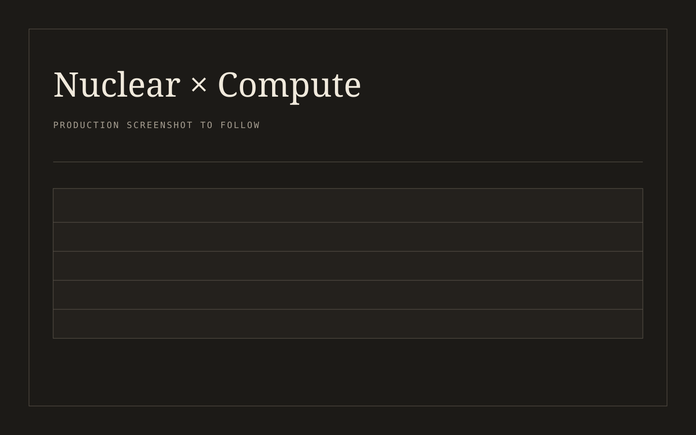

# Nuclear Data Center Deal Tracker

[](LICENSE)

Separate announced from binding. Every nuclear × large-load deal, its structure, its contractual weight, and what changed, in one free place.

The dataset is the product. The site is a static, filterable viewer with per-fact sourcing, a published bindingness rubric, open downloads, and a permanent changelog.

## Screenshot



## Quickstart

```bash
npm install
npm run dev
```

Open `http://localhost:3000`. To validate and export the production site:

```bash
npm test
npm run validate:data
npm run build
```

The static export is written to `out/`.

## Data

`data/deals.json` contains one object per deal. The schema is published at `data/schema.json` and enforced in CI. Core fields cover:

- named parties and buyer type
- technology and contract structure
- firm MW and optioned MW as separate values
- bindingness tier and evidence
- announcement, target, and status-change dates
- location and grid region
- sources with a statement of what each source supports
- analyst note, verification flag, and last-verified date

Generated downloads are available as JSON and CSV under `public/data/` after running the build.

## Bindingness

The seven-tier rubric runs from B0, unconfirmed reporting, through B5, operating under the deal. BX preserves dead, lapsed, and superseded records. Read the complete [methodology and rubric](https://lucaschatham.github.io/nuclear-datacenter-deal-tracker/about/).

## Contribute a correction

Open a [GitHub issue](https://github.com/lucaschatham/nuclear-datacenter-deal-tracker/issues) with the deal id, proposed correction, and a primary source. For direct additions, follow [CONTRIBUTING.md](CONTRIBUTING.md) and include a changelog entry.

## License

Code and data are available under the [MIT License](LICENSE). Informational only, not investment advice.
