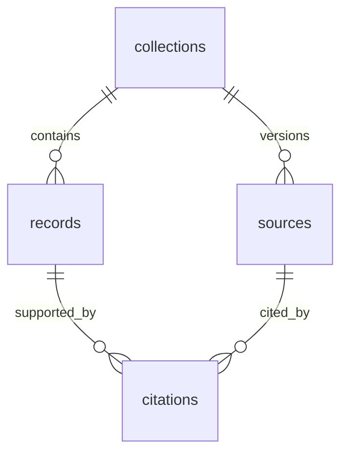

# SQLite database schema

Nuclear Atlas uses a local SQLite file as a dated collection archive. It stores source-native records and provenance without requiring a server or a universal nuclear industry data model.

- **Database:** `.local-data/nuclear-atlas.sqlite`, ignored by Git.
- **Local schema version:** `PRAGMA user_version = 1`.
- **Schema implementation:** [`SCHEMA` in local-store.py](../scripts/local-store.py).
- **Operations:** [imports, queries, exports, and backups](local-data-store.md).
- **Publication boundary:** Google Sheets and the reviewed workbook still generate the public static release. SQLite imports do not publish data.

The local schema version is independent of the imported Atlas release's `schemaVersion`, currently 2. Opening a local database with an unsupported schema version fails; there is no automatic migration framework.

## Relationships



All source, record, and citation identities are scoped to a collection. A citation references both its record and its source within that same collection. Generic source JSON imports create records and a source definition, but no normalized citation rows.

## Tables and fields

### `collections`

One imported batch, with its original file and collection-level provenance.

| Field | SQLite type | Meaning |
| --- | --- | --- |
| `id` | TEXT, primary key | Deterministic SHA-256 of collection kind, raw snapshot hash, and metadata |
| `kind` | TEXT, required | `atlas_release` or `source_json` |
| `imported_at_utc` | TEXT, required | Local import instant, with explicit UTC `Z`; not source retrieval time |
| `snapshot_sha256` | TEXT, required | SHA-256 of the exact input bytes |
| `snapshot_path` | TEXT, required | Path relative to the local storage directory |
| `record_count` | INTEGER, required | Number of records in this collection; must be positive |
| `metadata_json` | TEXT, required | Collection metadata encoded as JSON |

For `atlas_release`, metadata preserves the release's top-level fields except `sources` and `stages`, including its release ID, source cutoff, original review status, approval attribution, and workbook hashes. The original snapshot retains the complete stage bundles.

For `source_json`, metadata contains:

| JSON key | Meaning |
| --- | --- |
| `source_id`, `source_url` | Source identity and declared HTTPS URL |
| `scope` | User-supplied coverage, filters, and pagination description |
| `id_field` | Original field used as each record's identifier |
| `source_date_original` | Original date or period, or JSON null if unknown |
| `retrieved_at_utc` | Actual source retrieval instant ending in `Z`, or JSON null if unknown |
| `completeness` | `unknown`, `partial`, or `complete`; supplied by the importer caller |
| `review_status` | Always `observed` for generic source imports |

Declared source identity, scope, and completeness are not independently verified by the storage command. Archiving an Atlas release preserves its supplied approval metadata; it does not grant approval.

### `sources`

| Field | SQLite type | Meaning |
| --- | --- | --- |
| `collection_id` | TEXT, required | Foreign key to `collections.id` |
| `source_id` | TEXT, required | Original source identifier |
| `payload_json` | TEXT, required | Full source definition from the release; generic imports store `id` and `url` |

Composite primary key: `(collection_id, source_id)`. Publisher, authority class, geography, and other release source fields remain in the JSON payload when provided.

### `records`

| Field | SQLite type | Meaning |
| --- | --- | --- |
| `collection_id` | TEXT, required | Foreign key to `collections.id` |
| `record_id` | TEXT, required | Original record identifier, retained as a string |
| `stage` | TEXT, nullable | Lifecycle stage for Atlas records; SQL NULL for generic source records |
| `payload_json` | TEXT, required | Complete original record object, including unknown values |

Composite primary key: `(collection_id, record_id)`. Indexes on `record_id` and `stage` support history lookups and lifecycle queries. Records are not automatically merged across collections or sources.

### `citations`

| Field | SQLite type | Meaning |
| --- | --- | --- |
| `collection_id` | TEXT, required | Collection that owns the citation |
| `citation_id` | TEXT, required | Original citation identifier |
| `record_id` | TEXT, required | Cited record within this collection |
| `source_id` | TEXT, required | Supporting source within this collection |
| `payload_json` | TEXT, required | Complete citation, including supported fields, locator, dates, precision, and review status |

Composite primary key: `(collection_id, citation_id)`. Composite foreign keys reference `records` and `sources`; an index on `source_id` supports source lookups. Citation payloads also remain embedded in the original Atlas record payload, preserving the source record intact.

## Exact schema DDL

The following matches the current schema implementation. The CLI enables `PRAGMA foreign_keys = ON` for each connection. External writers must enable it themselves.

```sql
CREATE TABLE IF NOT EXISTS collections (
    id TEXT PRIMARY KEY,
    kind TEXT NOT NULL CHECK(kind IN ('atlas_release', 'source_json')),
    imported_at_utc TEXT NOT NULL,
    snapshot_sha256 TEXT NOT NULL,
    snapshot_path TEXT NOT NULL,
    record_count INTEGER NOT NULL CHECK(record_count > 0),
    metadata_json TEXT NOT NULL
);
CREATE TABLE IF NOT EXISTS sources (
    collection_id TEXT NOT NULL REFERENCES collections(id),
    source_id TEXT NOT NULL,
    payload_json TEXT NOT NULL,
    PRIMARY KEY(collection_id, source_id)
);
CREATE TABLE IF NOT EXISTS records (
    collection_id TEXT NOT NULL REFERENCES collections(id),
    record_id TEXT NOT NULL,
    stage TEXT,
    payload_json TEXT NOT NULL,
    PRIMARY KEY(collection_id, record_id)
);
CREATE TABLE IF NOT EXISTS citations (
    collection_id TEXT NOT NULL,
    citation_id TEXT NOT NULL,
    record_id TEXT NOT NULL,
    source_id TEXT NOT NULL,
    payload_json TEXT NOT NULL,
    PRIMARY KEY(collection_id, citation_id),
    FOREIGN KEY(collection_id, record_id) REFERENCES records(collection_id, record_id),
    FOREIGN KEY(collection_id, source_id) REFERENCES sources(collection_id, source_id)
);
CREATE INDEX IF NOT EXISTS records_by_id ON records(record_id);
CREATE INDEX IF NOT EXISTS records_by_stage ON records(stage);
CREATE INDEX IF NOT EXISTS citations_by_source ON citations(source_id);
PRAGMA user_version = 1;
```

## Evidence and history rules

- Identical raw bytes, collection kind, and metadata produce the same collection ID. Reimporting them does not duplicate rows or update the original import time.
- Changed content or metadata produces a new collection. Supplying a different actual retrieval instant preserves a new collection even when raw content is unchanged.
- Import commands append collections in a transaction. They never overwrite old records or infer that an absent record was deleted.
- The CLI validates nonempty string identifiers, duplicate IDs, release references, and counts before insertion. SQLite enforces the keys, foreign keys, and checks shown above. JSON shape, date validation, and append-only behavior are application rules, not database triggers or JSON column constraints.
- Source dates and periods stay in their original form, such as `2025Q1` or `2022`. Missing values remain null. Import time never substitutes for a missing retrieval time.
- `payload_json` preserves JSON values, but normalizes JSON formatting and key order. Exact input bytes live in `snapshots/<sha256>.json`.
- Snapshot files are written before the database transaction. An interrupted or failed import can leave an unreferenced file; it does not create a published collection.
- Export verifies the original snapshot hash and copies those bytes. It does not build a release from modified database rows.

## Query one snapshot

Counts across collections include history. Select a collection before counting facilities or comparing records. Replace `COLLECTION_ID` with an ID from `npm run db:status`.

```sql
SELECT stage, count(*) AS record_count
FROM records
WHERE collection_id = 'COLLECTION_ID'
GROUP BY stage;

SELECT r.record_id, c.citation_id, s.source_id,
       c.payload_json AS citation, s.payload_json AS source
FROM records AS r
JOIN citations AS c
  ON c.collection_id = r.collection_id AND c.record_id = r.record_id
JOIN sources AS s
  ON s.collection_id = c.collection_id AND s.source_id = c.source_id
WHERE r.collection_id = 'COLLECTION_ID'
  AND r.record_id = 'ops_nrc_05000220_2025q1';
```

## Storage and recovery

SQLite holds structured payloads; raw JSON files live beside it. `npm run db:backup` creates an integrity-checked database backup using SQLite's backup API. Preserve the `snapshots/` folder with the backup to retain byte-for-byte exports. Backups on the same computer are not protection against loss of that computer.

The repository publishes the schema, importer, tests, and instructions. Local database files, snapshots, and backups remain excluded from Git.
