# Nuclear Atlas: methodology and living PRD

Working draft | Version 0.2

Help people understand nuclear projects, compare public evidence, and see what remains unknown across the nuclear lifecycle.

This document distinguishes current implementation from planned work. Registered source capabilities are not a claim that all fields are ingested or published.

## Workflow

1. **Collect.** Gather public records from approved sources and record when each source was checked. The collection workflow is configured for daily checks. A schedule does not prove a recent successful run.

2. **Keep the original.** Preserve imported records in local SQLite, with original JSON snapshots and their source dates. Scheduled collection receipts remain in Git. Local imports are separate; automatic collection into SQLite is not connected.

3. **Review the evidence.** Check the source, dates, and facility match. Keep unknowns and conflicts visible. Human review is required before publication. Google Sheets and the reviewed workbook remain the authoring layer.

4. **Publish a snapshot.** Validate the reviewed release and generate the static website and public downloads. Automatic publication of new source claims is not connected. Existing public releases remain dated.

5. **Explore the lifecycle.** Use Map and Table to find records and inspect the public evidence behind them. All seven stages contain records. Coverage remains uneven and primarily U.S.; an empty result is not a known zero.

### One horizontal workflow, on every screen

```mermaid
flowchart LR
  accTitle: Nuclear Atlas source-to-dashboard workflow
  accDescr: Individual sources form a vertical list on the left and converge on one shared workflow. Solid source connections mean automated collection; dashed connections are not automated. Human review is required before publication.
  %% source: nrc-reactor-status
  source_0["NRC daily power reactor status<br/>Automated collection<br/>Which U.S. power reactor reported each reading<br/>How much of its full power it was producing<br/>The day that power level was reported"]
  source_0 --> step_0
  %% source: nrc-adams
  source_1["ADAMS Public Search<br/>Manual review<br/>Applications to build or operate a reactor<br/>Inspection findings and regulator questions<br/>Licenses and spent fuel storage decisions"]
  source_1 -.-> step_0
  %% source: nrc-structured-datasets
  source_2["NRC structured nuclear datasets<br/>Candidate source<br/>Lists of reactors and their license details<br/>Reported plant events and inspection findings<br/>Approved spent fuel storage systems"]
  source_2 -.-> step_0
  %% source: federal-register-nrc
  source_3["Federal Register NRC documents<br/>Automated collection<br/>New NRC notices and proposed rules<br/>Dates of public hearings and comment periods<br/>Official document links for licensing actions"]
  source_3 --> step_0
  %% source: govinfo-federal-register
  source_4["GovInfo Federal Register collection<br/>Manual review<br/>The official published copy of a federal notice<br/>The edition date and document identifier<br/>The legal text used to check a reported action"]
  source_4 -.-> step_0
  %% source: regulations-gov-nrc
  source_5["Regulations.gov NRC dockets<br/>Manual review<br/>Documents in an NRC rulemaking docket<br/>Comments submitted by the public<br/>Supporting studies and comment deadlines"]
  source_5 -.-> step_0
  %% source: usaspending-nuclear
  source_6["USAspending nuclear procurement awards and modifications<br/>Automated collection<br/>Which organization received a federal award<br/>How much money the government has committed<br/>Award identifiers and changes over time"]
  source_6 --> step_0
  %% source: sam-opportunities-nuclear
  source_7["SAM.gov nuclear contract opportunities<br/>Manual review<br/>Nuclear work federal agencies want to buy<br/>Proposal deadlines and amendments<br/>The agency and contact for an opportunity"]
  source_7 -.-> step_0
  %% source: grants-gov-nuclear
  source_8["Grants.gov nuclear opportunities<br/>Automated collection<br/>Federal funding opportunity titles<br/>Which agency offers each opportunity<br/>Whether an opportunity is forecast or posted"]
  source_8 --> step_0
  %% source: osti-nuclear
  source_9["DOE OSTI nuclear records<br/>Access tested<br/>DOE-funded nuclear research reports<br/>Published datasets and demonstration results<br/>Authors, report dates, and document links"]
  source_9 -.-> step_0
  %% source: doe-program-pages
  source_10["DOE nuclear program and award pages<br/>Manual review<br/>Projects selected for government support<br/>Announced loan commitments and funding<br/>Reported project milestones"]
  source_10 -.-> step_0
  %% source: sec-edgar-oklo
  source_11["SEC EDGAR submissions for Oklo<br/>Access tested<br/>Dates and types of Oklo's investor filings<br/>Filed contracts and financing disclosures<br/>Company statements about risks and schedules"]
  source_11 -.-> step_0
  %% source: eia-nuclear
  source_12["EIA nuclear and electricity data<br/>Manual review<br/>Electricity generated by nuclear plants<br/>Reported reactor outages and plant ownership<br/>Survey results on uranium purchases and fuel"]
  source_12 -.-> step_0
  %% source: ferc-electric
  source_13["FERC electric data and filings<br/>Manual review<br/>Federal electricity market proceedings<br/>Filed power sale agreements<br/>Reported wholesale electricity transactions"]
  source_13 -.-> step_0
  %% source: iso-rto-queues
  source_14["ISO and RTO interconnection queues<br/>Candidate source<br/>Projects applying to connect to the power grid<br/>Their requested size and connection location<br/>Whether a grid study is pending or complete"]
  source_14 -.-> step_0
  %% source: state-puc-dockets
  source_15["State public utility commission dockets<br/>Candidate source<br/>Utility plans for new power projects<br/>Requests to charge customers for project costs<br/>State decisions and hearing testimony"]
  source_15 -.-> step_0
  %% source: local-permitting
  source_16["Local permitting and public meeting portals<br/>Candidate source<br/>Land-use and building permit applications<br/>Public meetings about a proposed site<br/>Local water, road, and tax proceedings"]
  source_16 -.-> step_0
  %% source: epa-echo
  source_17["EPA ECHO facility compliance data<br/>Candidate source<br/>A facility's environmental permits<br/>Inspection and violation records<br/>Enforcement actions and their dates"]
  source_17 -.-> step_0
  %% source: epa-radnet
  source_18["EPA RadNet monitoring data<br/>Candidate source<br/>Radiation readings at EPA monitoring stations<br/>Where and when readings were taken<br/>Changes in readings over time"]
  source_18 -.-> step_0
  %% source: usgs-water
  source_19["USGS Water Data APIs<br/>Candidate source<br/>How much water flows through nearby rivers<br/>Groundwater levels at measurement sites<br/>Measured water quality over time"]
  source_19 -.-> step_0
  %% source: fema-national-risk-index
  source_20["FEMA National Risk Index<br/>Candidate source<br/>Local exposure to floods and earthquakes<br/>Estimated losses from natural hazards<br/>Community-level vulnerability indicators"]
  source_20 -.-> step_0
  %% source: census-community
  source_21["Census community and business data<br/>Candidate source<br/>How many people live around a site<br/>Local housing, household income, and age groups<br/>Counts of nearby businesses"]
  source_21 -.-> step_0
  %% source: bls-qcew
  source_22["BLS Quarterly Census of Employment and Wages<br/>Candidate source<br/>Jobs reported by county and industry<br/>Average wages in those industries<br/>How concentrated an industry is locally"]
  source_22 -.-> step_0
  %% source: noaa-climate
  source_23["NOAA climate and severe weather data<br/>Candidate source<br/>Past temperatures and rainfall<br/>Recorded severe weather events<br/>Long-term climate observations near a site"]
  source_23 -.-> step_0
  %% source: nrc-spent-fuel
  source_24["NRC spent fuel storage licensing and datasets<br/>Candidate source<br/>Where licensed U.S. spent fuel storage sites are<br/>Which storage containers regulators approve<br/>License terms, renewals, and conditions"]
  source_24 -.-> step_0
  %% source: usitc-census-trade
  source_25["Official U.S. trade data<br/>Candidate source<br/>Reported imports and exports by material category<br/>The countries goods come from or go to<br/>Reported trade quantities and values"]
  source_25 -.-> step_0
  %% source: doe-spent-fuel
  source_26["DOE spent fuel and environmental management records<br/>Manual review<br/>Published spent fuel inventory estimates<br/>Cleanup and disposal project reports<br/>Transport and storage planning documents"]
  source_26 -.-> step_0
  %% source: kairos-power-updates
  source_27["Kairos Power project updates<br/>Manual review<br/>Construction milestones Kairos announces<br/>The company's target project dates<br/>Customer agreements the company describes"]
  source_27 -.-> step_0
  %% source: constellation-investor-relations
  source_28["Constellation Energy investor relations<br/>Manual review<br/>Plant and restart milestones the company reports<br/>Announced electricity supply agreements<br/>Company financing and project updates"]
  source_28 -.-> step_0
  %% source: talen-investor-relations
  source_29["Talen Energy investor relations<br/>Manual review<br/>Reported Susquehanna plant developments<br/>Announced data center electricity agreements<br/>Company statements about financing and grid issues"]
  source_29 -.-> step_0
  %% source: energy-northwest-publications
  source_30["Energy Northwest public finance and project records<br/>Manual review<br/>Public project finance reports<br/>Construction plans and target dates<br/>Reported customers and project partners"]
  source_30 -.-> step_0
  %% source: iaea-nuclear-data
  source_31["IAEA nuclear databases and spent fuel resources<br/>Candidate source<br/>Reactors reported by participating countries<br/>Reported fuel cycle facilities<br/>Country-level spent fuel information"]
  source_31 -.-> step_0
  %% source: oecd-nea-nuclear-data
  source_32["OECD NEA nuclear dashboards and publications<br/>Candidate source<br/>Nuclear programs in member countries<br/>Published construction and operating comparisons<br/>Studies of nuclear costs and policy"]
  source_32 -.-> step_0
  %% source: third-party-nuclear-trackers
  source_33["Independent nuclear trackers and trade reporting<br/>Manual review<br/>Project names and locations to investigate<br/>Reported milestones to check against primary records<br/>Links that help find original evidence"]
  source_33 -.-> step_0
  step_0["Collect<br/>Gather public records from approved sources and record when each source was checked.<br/>The collection workflow is configured for daily checks. A schedule does not prove a recent successful run."]
  step_0 --> step_1
  step_1["Keep the original<br/>Preserve imported records in local SQLite, with original JSON snapshots and their source dates.<br/>Scheduled collection receipts remain in Git. Local imports are separate; automatic collection into SQLite is not connected."]
  step_1 --> step_2
  step_2["Review the evidence<br/>Check the source, dates, and facility match. Keep unknowns and conflicts visible.<br/>Human review is required before publication. Google Sheets and the reviewed workbook remain the authoring layer."]
  step_2 --> step_3
  step_3["Publish a snapshot<br/>Validate the reviewed release and generate the static website and public downloads.<br/>Automatic publication of new source claims is not connected. Existing public releases remain dated."]
  step_3 --> step_4
  step_4["Explore the lifecycle<br/>Use Map and Table to find records and inspect the public evidence behind them.<br/>All seven stages contain records. Coverage remains uneven and primarily U.S.; an empty result is not a known zero."]
  class step_0,step_1,step_2,step_3,step_4 action
  class source_0,source_1,source_2,source_3,source_4,source_5,source_6,source_7,source_8,source_9,source_10,source_11,source_12,source_13,source_14,source_15,source_16,source_17,source_18,source_19,source_20,source_21,source_22,source_23,source_24,source_25,source_26,source_27,source_28,source_29,source_30,source_31,source_32,source_33 store
```

## Storage and recovery

### Local SQLite collection archive (Current)

Imported source records, collection metadata, and citations are stored locally. Original JSON snapshots sit beside the database, with dated SQLite backups. This archive does not publish to the website.

Location: .local-data/nuclear-atlas.sqlite and .local-data/snapshots/

### Git retains collection receipts (Current)

The existing scheduled collection workflow stores retrieval receipts, review candidates, and evidence history in Git. It is not automatically connected to the local SQLite archive.

Location: data/credibility/

### Reviewed workbook and static releases (Current)

Google Sheets and the reviewed workbook remain the authoring layer. Approved release JSON generates the public website and downloads. Visitors do not query SQLite or Google Sheets.

Location: data/releases/atlas-release.xlsx and data/atlas-release.json

### Retention and recovery beyond this computer (Decision needed)

Local database backups exist. An off-device backup destination, per-source raw-file retention, and unattended collection into SQLite remain to be defined. Existing permitted Actions artifacts retain their configured 90-day lifetime.

Location: No off-device SQLite backup is configured

### Decision tests

- **History and queries:** Do we only serve current snapshots, or need reliable queries across years of records? Measure daily records, growth, and the historical queries a real user needs.

- **Retention and recovery:** Which raw records can we retain, for how long, and how do we restore them? Approve per-source retention, export an archive, and prove a hash-checked restore.

- **Publication authority:** Who can approve evidence, and what may deterministic code publish? Keep human review; test permissions, conflicts, rollback, and failure without an AI reviewer.

- **Time and identity:** How do we reconcile dates and entities without inventing precision? Define stable IDs, preserve original dates, and test offset and daylight-saving conversions.

## Who it is for

### Researchers and analysts

Find facilities and projects, compare their public records, and trace claims to original sources.

### Developers, buyers, and suppliers

Explore documented projects, licensing activity, and fuel-cycle facilities. Private commercial availability remains unknown.

### Communities and journalists

Understand what is documented about a site, its lifecycle, and its public regulatory record.

### Industry professionals

Follow related facilities and evidence across operations, spent fuel, waste, and decommissioning.

## Dashboard interaction contract

### Discover (Current)

Lifecycle tabs come first. A persona lens sets a starting view; search, technology, evidence strength, and location precision narrow it. Sources are available from the health trigger.

### Explore (Current)

Map and Table share records and selection. Desktop has a layer rail and inspector; mobile uses drawers and a full-height evidence sheet.

### Verify (Current)

The inspector exposes cited records, verification dates, contractual support, and location precision. Users can download public data or open the full project page.

### Understand missing coverage (Planned)

Replace empty-map warnings with a Coverage Workspace showing relevant sources, blockers, and the next publication milestone. Do not turn missing coverage into a count of zero.

## Lifecycle scope

### Projects (Published)

For: Energy buyers, developers, capital providers

- Who is buying power from whom?
- How binding is the commitment?
- What capacity and target dates are actually supported?

Next: The current Projects dataset covers announced fission deals with named large-load buyers or developers. It is not an inventory of every planned reactor.

### Fuel Supply (Published)

For: Fuel procurement teams and suppliers

- Which facilities provide each step of the fuel cycle?
- Which fuel types do planned reactors require?
- Which publicly documented constraints affect supply?

Next: Facility listings do not establish available supply, private contracts, or supplier lead times.

### Build & License (Published)

For: Developers, suppliers, regulators

- Which applications and permits have been filed?
- Which approvals and construction milestones are complete?
- What is the next documented decision or deadline?

Next: Selected licensing records are published. Applications, approvals, and construction milestones are not comprehensively tracked.

### Operations (Published)

For: Grid planners, operators, energy buyers

- Which reactors report operating power?
- How has reported output changed?
- What official records explain an outage or event?

Next: The NRC snapshot includes operating status and oversight records. Live output and complete generation histories are not available here.

### Spent Fuel (Published)

For: Fuel managers, communities, regulators

- Where are licensed spent fuel storage sites?
- What inventory and storage systems are documented?
- What do licenses explicitly allow?

Next: Storage licensing records are published. Inventory and remaining capacity are not inferred.

### Waste & Disposal (Published)

For: Waste managers, regulators, communities

- Which facilities handle which waste classes?
- What is each facility's regulatory status?
- Which documented acceptance conditions apply?

Next: Selected public disposal records are included. Waste acceptance rules and service areas need source-specific interpretation.

### Decommissioning (Published)

For: Site owners, contractors, communities

- Which sites are in each decommissioning phase?
- What milestones and target dates are documented?
- What obligations remain for cleanup and stored fuel?

Next: Public status and strategy records are included. Detailed costs, schedules, and historical milestones remain incomplete.

## Evidence rules

### Source authority has limits

A license proves a regulatory action, not project profitability. Company statements remain company claims. Third-party trackers help discover evidence; they do not replace it.

### Unknown stays unknown

Do not infer private prices, supplier lead times, available fuel, or spare spent fuel capacity. Separate contracted capacity from options and preliminary plans.

### Keep dates distinct

A source publication date, an effective date, and a retrieval time answer different questions. Preserve date-only values and original periods; UTC instants retain their Z suffix.

### Show how fresh the evidence is

Sources publish on different schedules. Checking a source today does not make its older records current. Collection failures must remain visible.

### Corrections remain visible

Retain evidence history and cite the replacement. Source outages must not erase approved facts. Conflicts and ambiguous entity matches require a human decision.

### People approve factual changes

A successful download or an AI summary does not authorize publication. Human review checks the supporting evidence and resolves ambiguous matches before a new release.

### Bindingness rubric

- **B0:** Reported without party confirmation
- **B1:** Announced intent, memorandum, or nonbinding letter
- **B2:** Funded development or feasibility work without binding offtake
- **B3:** Signed power purchase or definitive agreement
- **B4:** Binding agreement plus physical or regulatory progress
- **B5:** Operating under the agreement
- **BX:** Dead, lapsed, or superseded, retained as history

## Non-goals

- No private-price or supplier-capacity estimates presented as facts.
- No universal readiness, safety, or investment score.
- No claim of complete global or lifecycle coverage.
- No AI-authorized publication of factual changes.

## Acceptance criteria

- [ ] Reproduce every material claim from a cited source and locator.
- [ ] Keep Map and Table record IDs identical under every filter.
- [ ] Show location precision, source dates, and collection failures without implying certainty.
- [ ] Pass mobile, keyboard, contrast, static-export, and public-download tests.
- [ ] Before a storage cutover, reconcile shadow runs and restore archived records.
- [ ] Before automatic publication, approve each source, adapter version, and claim type explicitly.

## All 34 registered source families

Examples describe source capabilities. Automated collection is not approval to publish. Family-level registrations may still need individual datasets and jurisdictions onboarded.

### NRC daily power reactor status

- Source: https://www.nrc.gov/reading-rm/doc-collections/event-status/reactor-status/powerreactorstatusforlast365days.txt
- State: Automated collection
- Category: Reactors and regulation
- Geography: US
- Access: dataset; source cadence: daily
- Authority: official regulatory
- Last recorded check (UTC): 2026-08-25T16:53:45.664Z

- Which U.S. power reactor reported each reading
- How much of its full power it was producing
- The day that power level was reported

Daily operating power is official operational evidence, not evidence of project economics or future schedule.

### ADAMS Public Search

- Source: https://adams-api-developer.nrc.gov/
- State: Manual review
- Category: Reactors and regulation
- Geography: US
- Access: api; source cadence: intra day
- Authority: official regulatory
- Last recorded check (UTC): No published receipt

- Applications to build or operate a reactor
- Inspection findings and regulator questions
- Licenses and spent fuel storage decisions

API access and the current query contract must be approved before automation.

### NRC structured nuclear datasets

- Source: https://www.nrc.gov/data/index
- State: Candidate source
- Category: Reactors and regulation
- Geography: US
- Access: dataset; source cadence: irregular
- Authority: official regulatory
- Last recorded check (UTC): No published receipt

- Lists of reactors and their license details
- Reported plant events and inspection findings
- Approved spent fuel storage systems

Each linked dataset needs its own cadence and schema contract before ingestion.

### Federal Register NRC documents

- Source: https://www.federalregister.gov/api/v1/documents.json
- State: Automated collection
- Category: Reactors and regulation
- Geography: US
- Access: api; source cadence: daily
- Authority: official government
- Last recorded check (UTC): 2026-08-25T16:53:45.664Z

- New NRC notices and proposed rules
- Dates of public hearings and comment periods
- Official document links for licensing actions

Use GovInfo to verify the official legal edition before treating a notice as dispositive.

### GovInfo Federal Register collection

- Source: https://api.govinfo.gov/collections/FR/
- State: Manual review
- Category: Reactors and regulation
- Geography: US
- Access: api; source cadence: daily
- Authority: official legal
- Last recorded check (UTC): No published receipt

- The official published copy of a federal notice
- The edition date and document identifier
- The legal text used to check a reported action

The date-path collection API needs a dedicated adapter before it can verify Federal Register candidates automatically.

### Regulations.gov NRC dockets

- Source: https://api.regulations.gov/v4/documents
- State: Manual review
- Category: Reactors and regulation
- Geography: US
- Access: api; source cadence: daily
- Authority: official government
- Last recorded check (UTC): No published receipt

- Documents in an NRC rulemaking docket
- Comments submitted by the public
- Supporting studies and comment deadlines

Register a production API key and add docket-specific queries before automation.

### USAspending nuclear procurement awards and modifications

- Source: https://api.usaspending.gov/api/v2/search/spending_by_award/
- State: Automated collection
- Category: Money and government support
- Geography: US
- Access: api; source cadence: daily
- Authority: official government
- Last recorded check (UTC): 2026-08-25T16:58:49.156Z

- Which organization received a federal award
- How much money the government has committed
- Award identifiers and changes over time

The incremental window uses Last Modified Date for procurement awards. USAspending forbids mixing award-type groups in one request, so grants, loans, and other assistance remain an explicit adapter coverage gap. Awards prove reported federal obligations, not project completion or total private financing.

### SAM.gov nuclear contract opportunities

- Source: https://api.sam.gov/prod/opportunities/v2/search
- State: Manual review
- Category: Money and government support
- Geography: US
- Access: api; source cadence: daily
- Authority: official government
- Last recorded check (UTC): No published receipt

- Nuclear work federal agencies want to buy
- Proposal deadlines and amendments
- The agency and contact for an opportunity

A solicitation is evidence of procurement activity, not proof of an award.

### Grants.gov nuclear opportunities

- Source: https://api.grants.gov/v1/api/search2
- State: Automated collection
- Category: Money and government support
- Geography: US
- Access: api; source cadence: daily
- Authority: official government
- Last recorded check (UTC): 2026-08-25T16:53:45.664Z

- Federal funding opportunity titles
- Which agency offers each opportunity
- Whether an opportunity is forecast or posted

Opportunities prove available funding programs, not awards to a project.

### DOE OSTI nuclear records

- Source: https://www.osti.gov/api/v1/records
- State: Access tested
- Category: Money and government support
- Geography: US
- Access: api; source cadence: daily
- Authority: official government
- Last recorded check (UTC): No published receipt

- DOE-funded nuclear research reports
- Published datasets and demonstration results
- Authors, report dates, and document links

Technical publications provide research evidence, not commercial project approval.

### DOE nuclear program and award pages

- Source: https://www.energy.gov/ne/office-nuclear-energy
- State: Manual review
- Category: Money and government support
- Geography: US
- Access: html; source cadence: irregular
- Authority: official government
- Last recorded check (UTC): No published receipt

- Projects selected for government support
- Announced loan commitments and funding
- Reported project milestones

Prefer RSS or structured feeds when a DOE office exposes them; otherwise require review.

### SEC EDGAR submissions for Oklo

- Source: https://data.sec.gov/submissions/CIK0001849056.json
- State: Access tested
- Category: Money and government support
- Geography: US
- Access: api; source cadence: intra day
- Authority: counterparty filing
- Last recorded check (UTC): No published receipt

- Dates and types of Oklo's investor filings
- Filed contracts and financing disclosures
- Company statements about risks and schedules

Enable automation only after SEC_USER_AGENT identifies the project and a monitored contact address.

### EIA nuclear and electricity data

- Source: https://api.eia.gov/v2/
- State: Manual review
- Category: Power and the grid
- Geography: US
- Access: api; source cadence: daily
- Authority: official government
- Last recorded check (UTC): No published receipt

- Electricity generated by nuclear plants
- Reported reactor outages and plant ownership
- Survey results on uranium purchases and fuel

Each EIA route has its own source cadence and requires a field-specific adapter.

### FERC electric data and filings

- Source: https://data.ferc.gov/
- State: Manual review
- Category: Power and the grid
- Geography: US
- Access: api; source cadence: irregular
- Authority: official government
- Last recorded check (UTC): No published receipt

- Federal electricity market proceedings
- Filed power sale agreements
- Reported wholesale electricity transactions

Data catalog assets, eLibrary filings, and EQR transactions need separate adapters.

### ISO and RTO interconnection queues

- Source: https://www.ferc.gov/power-sales-and-markets/rtos-and-isos
- State: Candidate source
- Category: Power and the grid
- Geography: US
- Access: dataset; source cadence: irregular
- Authority: independent primary
- Last recorded check (UTC): No published receipt

- Projects applying to connect to the power grid
- Their requested size and connection location
- Whether a grid study is pending or complete

Build one source definition per queue because formats and cadence differ by operator.

### State public utility commission dockets

- Source: https://www.naruc.org/about-naruc/regulatory-commissions/
- State: Candidate source
- Category: Power and the grid
- Geography: US
- Access: portal; source cadence: irregular
- Authority: official government
- Last recorded check (UTC): No published receipt

- Utility plans for new power projects
- Requests to charge customers for project costs
- State decisions and hearing testimony

The NARUC directory is discovery only; each commission portal needs independent approval.

### Local permitting and public meeting portals

- Source: https://www.usa.gov/local-governments
- State: Candidate source
- Category: Sites and communities
- Geography: US
- Access: portal; source cadence: irregular
- Authority: official government
- Last recorded check (UTC): No published receipt

- Land-use and building permit applications
- Public meetings about a proposed site
- Local water, road, and tax proceedings

Register Accela, ArcGIS, Socrata, and county-specific systems as separate sources.

### EPA ECHO facility compliance data

- Source: https://echo.epa.gov/tools/data-downloads
- State: Candidate source
- Category: Sites and communities
- Geography: US
- Access: bulk; source cadence: weekly
- Authority: official government
- Last recorded check (UTC): No published receipt

- A facility's environmental permits
- Inspection and violation records
- Enforcement actions and their dates

A daily check must display ECHO's weekly source refresh and possible upstream lag.

### EPA RadNet monitoring data

- Source: https://www.epa.gov/radnet/radnet-csv-file-downloads
- State: Candidate source
- Category: Sites and communities
- Geography: US
- Access: dataset; source cadence: intra day
- Authority: official government
- Last recorded check (UTC): No published receipt

- Radiation readings at EPA monitoring stations
- Where and when readings were taken
- Changes in readings over time

RadNet readings are contextual monitoring data, not project-specific compliance findings.

### USGS Water Data APIs

- Source: https://api.waterdata.usgs.gov/ogcapi/v0/
- State: Candidate source
- Category: Sites and communities
- Geography: US
- Access: api; source cadence: intra day
- Authority: official government
- Last recorded check (UTC): No published receipt

- How much water flows through nearby rivers
- Groundwater levels at measurement sites
- Measured water quality over time

Monitoring locations must be explicitly linked to a project site before use.

### FEMA National Risk Index

- Source: https://www.fema.gov/flood-maps/products-tools/national-risk-index
- State: Candidate source
- Category: Sites and communities
- Geography: US
- Access: dataset; source cadence: irregular
- Authority: official government
- Last recorded check (UTC): No published receipt

- Local exposure to floods and earthquakes
- Estimated losses from natural hazards
- Community-level vulnerability indicators

Risk estimates provide site context and must not be presented as a plant-specific safety finding.

### Census community and business data

- Source: https://api.census.gov/data.html
- State: Candidate source
- Category: Sites and communities
- Geography: US
- Access: api; source cadence: annual
- Authority: official government
- Last recorded check (UTC): No published receipt

- How many people live around a site
- Local housing, household income, and age groups
- Counts of nearby businesses

Always display the survey year and estimate type beside community metrics.

### BLS Quarterly Census of Employment and Wages

- Source: https://www.bls.gov/cew/downloadable-data-files.htm
- State: Candidate source
- Category: Sites and communities
- Geography: US
- Access: bulk; source cadence: quarterly
- Authority: official government
- Last recorded check (UTC): No published receipt

- Jobs reported by county and industry
- Average wages in those industries
- How concentrated an industry is locally

Quarterly labor data must display its quarter and publication lag.

### NOAA climate and severe weather data

- Source: https://www.ncei.noaa.gov/support/access-data-service-api-user-documentation
- State: Candidate source
- Category: Sites and communities
- Geography: US
- Access: api; source cadence: daily
- Authority: official government
- Last recorded check (UTC): No published receipt

- Past temperatures and rainfall
- Recorded severe weather events
- Long-term climate observations near a site

Climate observations provide site context and require explicit station or geography matching.

### NRC spent fuel storage licensing and datasets

- Source: https://www.nrc.gov/waste/spent-fuel-storage/licensing
- State: Candidate source
- Category: Fuel, waste, and supply chain
- Geography: US
- Access: dataset; source cadence: irregular
- Authority: official regulatory
- Last recorded check (UTC): No published receipt

- Where licensed U.S. spent fuel storage sites are
- Which storage containers regulators approve
- License terms, renewals, and conditions

A storage license defines authorization and conditions; it does not by itself prove remaining physical capacity.

### Official U.S. trade data

- Source: https://api.census.gov/data/timeseries/intltrade.html
- State: Candidate source
- Category: Fuel, waste, and supply chain
- Geography: US
- Access: api; source cadence: monthly
- Authority: official government
- Last recorded check (UTC): No published receipt

- Reported imports and exports by material category
- The countries goods come from or go to
- Reported trade quantities and values

Commodity-code selection must be documented and cannot establish private supplier capacity.

### DOE spent fuel and environmental management records

- Source: https://www.energy.gov/em
- State: Manual review
- Category: Fuel, waste, and supply chain
- Geography: US
- Access: html; source cadence: irregular
- Authority: official government
- Last recorded check (UTC): No published receipt

- Published spent fuel inventory estimates
- Cleanup and disposal project reports
- Transport and storage planning documents

Use underlying reports and datasets, not a broken dashboard shell.

### Kairos Power project updates

- Source: https://www.kairospower.com/updates
- State: Manual review
- Category: Company disclosures
- Geography: US
- Access: html; source cadence: irregular
- Authority: counterparty statement
- Last recorded check (UTC): No published receipt

- Construction milestones Kairos announces
- The company's target project dates
- Customer agreements the company describes

Counterparty statements require corroboration for regulatory and construction claims.

### Constellation Energy investor relations

- Source: https://investors.constellationenergy.com/news-events/news-releases
- State: Manual review
- Category: Company disclosures
- Geography: US
- Access: html; source cadence: irregular
- Authority: counterparty statement
- Last recorded check (UTC): No published receipt

- Plant and restart milestones the company reports
- Announced electricity supply agreements
- Company financing and project updates

Treat project statements as counterparty claims until corroborated by filings or regulators.

### Talen Energy investor relations

- Source: https://ir.talenenergy.com/news-events/news-releases
- State: Manual review
- Category: Company disclosures
- Geography: US
- Access: html; source cadence: irregular
- Authority: counterparty statement
- Last recorded check (UTC): No published receipt

- Reported Susquehanna plant developments
- Announced data center electricity agreements
- Company statements about financing and grid issues

Contract summaries are counterparty statements unless the filed agreement is public.

### Energy Northwest public finance and project records

- Source: https://www.energy-northwest.com/whoweare/finance/Pages/default.aspx
- State: Manual review
- Category: Company disclosures
- Geography: US-WA
- Access: pdf; source cadence: irregular
- Authority: counterparty statement
- Last recorded check (UTC): No published receipt

- Public project finance reports
- Construction plans and target dates
- Reported customers and project partners

PDF claims require an exact page locator and human review.

### IAEA nuclear databases and spent fuel resources

- Source: https://www.iaea.org/resources/databases
- State: Candidate source
- Category: International and discovery
- Geography: GLOBAL
- Access: portal; source cadence: irregular
- Authority: official government
- Last recorded check (UTC): No published receipt

- Reactors reported by participating countries
- Reported fuel cycle facilities
- Country-level spent fuel information

International data is registered for future work but excluded from U.S. launch ingestion.

### OECD NEA nuclear dashboards and publications

- Source: https://www.oecd-nea.org/
- State: Candidate source
- Category: International and discovery
- Geography: GLOBAL
- Access: portal; source cadence: irregular
- Authority: official government
- Last recorded check (UTC): No published receipt

- Nuclear programs in member countries
- Published construction and operating comparisons
- Studies of nuclear costs and policy

International coverage remains deferred until access and reuse are verified.

### Independent nuclear trackers and trade reporting

- Source: https://globalenergymonitor.org/projects/global-nuclear-power-tracker/
- State: Manual review
- Category: International and discovery
- Geography: US, GLOBAL
- Access: portal; source cadence: irregular
- Authority: secondary discovery
- Last recorded check (UTC): No published receipt

- Project names and locations to investigate
- Reported milestones to check against primary records
- Links that help find original evidence

Use only to discover primary records. Never let this source class override primary evidence.

## Contributing

Edit data/methodology.json for workflow steps and product requirements; edit data/credibility/source-examples.json for source examples. Source identities and collection states come from the existing source registry. The single Mermaid graph is generated from those same inputs.

Run npm run generate:methodology after diagram or theme changes. Run npm run generate:methodology:docs after content changes (also runs before local development and production builds). Changes should be reviewed before publication.

Code and Atlas-authored data use the MIT License. Upstream records retain their own terms. This tool does not guarantee global completeness, safety, investment returns, or available storage capacity.
